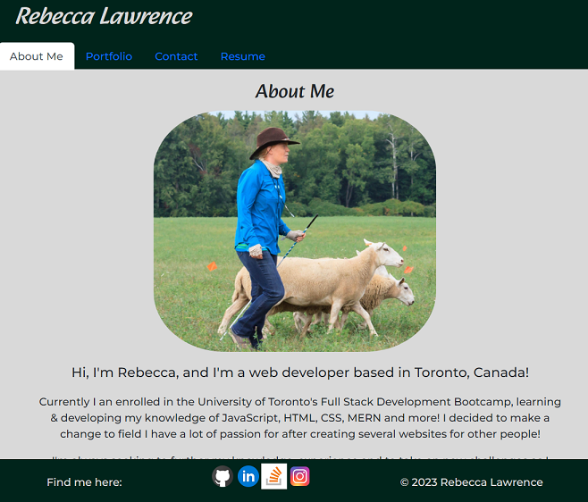

# My React Portfolio

## Description

This React portfolio was built to demonstrate my experience building single-page applications.   It was created to display my portfolio of work examples in one easy to access application.
  
 ## Table of Contents 
  - [Installation](#installation)
  - [Usage](#usage)
  - [License](#license)
  - [Contributing](#contributing)
  - [Test](#test)
  - [Questions](#questions)

## Installation

The deployed application is available to view at <a href = "https://rkml14.github.io/rkml-portfolio/">rkml14/rkml-portfolio</a>  

## Usage

To use the application, navigate through the tabs located at the top of the page.  You can also reach out to me via the contact page or via one of the socials linked in the footer.  

When I open the application, I am brought to Rebecca's application page,  where I are presented with navigation titles for 'About Me', Portfolio, Contact & Resume.

When I click on a navigation title, I am brought to the corresponding section.

On the About Me section, I can see a recent photo of Rebecca and a short bio about them.

When I am presented with the Portfolio section, I can see image of 6 of Rebecca's applicaiton with links to both the deployed applications & the corresponding GitHub repositories.

When I am presented with the Contaction section, I can see a contact for with fields for a name, email address & message.

When I am presented with the Resume section, I can see a link to a downloadable resume, along with a list of the developer's profiencies.  

## Contributing
If you would like to contribute to this application, please reach out to me via one of the means listed under Questions.

## Tests 

Not applicable for this application. 

## Credits

My favourite study buddy: <a href = "https://github.com/cassiewatsonn">Cassandra Watson </a>  One last time with feeling!   

My most amazing tutor: Dominique Meeks Gombe 

## License

MIT License 

## Questions

If you have any questions regarding this application, please contact me via one of the means below:

GitHub: <a href = "https://github.com/rkml14">Rebecca Lawrence </a>   
rkmlawrence@gmail.com  